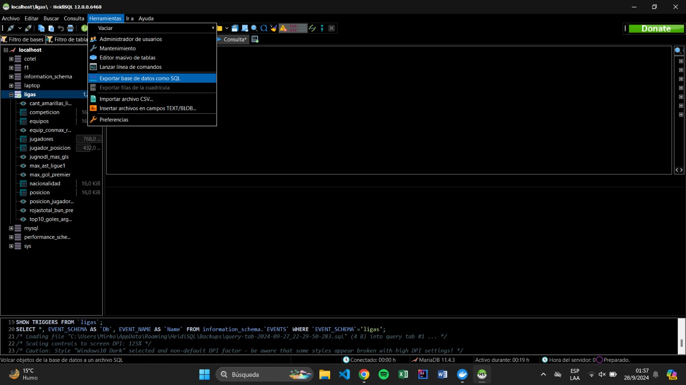

# Normalizacion-DB

## Introducción
El presente repositorio contiene la documentación necesaria para la normalización de una base de datos a partir de un archivo csv.
Además contamos con 3 archivos: 
- Top5ligas.sql que es la base de datos sin normalizar.
- Ligas.sql contiene la base de datos normalizada con sus respectivas vistas.
- Top5-players.csv del cual sacamos los respectivos datos qué luego importamos a nuestra base de datos normalizada.

### Base de Datos de estadistica sobre los jugadores de las 5 Grandes Ligas del Mundo.

Esta base de datos contiene toda la información sobre todas las estadisticas de la temporada 23/24 de las 5 mejores ligas de fútbol.

## Tabla de contenidos
1. [Instalacion (3)](#instalación)
2. [Uso(1)](#uso)
3. [Diagrama de Relacion de Entidad](#diagrama-de-relación-de-entidad)
4. [Paso a Paso para la normalización de un archivo csv o xlsx (10)](#paso-a-paso-para-la-normalización-de-un-archivo-csv-o-xlsx)
5. [Consultas](#consultasvistas)
6. [Conclusión](#conclusión)
7. [Bibliografía](#bibliografía)


## `1. Instalación`

## 1.1 Clona este repositorio.
```bash
    git clone https://github.com/GermanS23/Normalizacion-DB.git
 ```

## 1.2 Abrir Heidi o MYSQL Workbench.
Una vez abierto nuestro programa para base de datos, seguir las intrucciones para poder importarla correctamente. <br/>
**Importante:** Para evitar problemas a la hora de la carga del archivo "ligas.sql", se recomienda tener actualizado su Docker o MYSQL Server a la última versión del mismo, esto con el fin de evitar inconvenientes de compatibilidad.


## 1.3 Importación del archivo ligas.sql (MYSQL Work)
Después de haber entrado a nuestro lugar de trabajo, nos dirigimos a la parte superior izquierda, en las opciones de file, buscamos la opción **Open SQL Script** y nos aparecerá una interfaz donde deberemos buscar el archivo "liga.sql" en el directorio que hayamos clonado el repositorio, para finalizar le damos "run" al script que nos aparecerá, y tendremos la base de datos cargada.


## 1.3.5 Importación del archivo ligas.sql (Heidi)
Siguiendo los mismos pasos al igual que con Workbench, buscaremos la opción **Cargar archivo SQL**, buscaremos en el directorio que clonamos este repositorio el archivo .sql, lo seleccionaremos, y nos creará todo el script que al darle **Run** nos cargará la base de datos.


## `2. Uso`

## 2.1 Una vez cargada la base de datos, dirigirse a [Consultas](#consultasvistas).
Al dirigirnos a la sección [Consultas](#consultasvistas) , se podrá realizar pruebas para comprobar que la base de datos funcione y se haya cargado correctamente.


## `3. Diagrama de Relación de Entidad`


## `4. Paso a Paso para la normalización de un archivo csv o xlsx`

## 4.1 Seleccionar el dataset que queramos normalizar, en formato csv o xlsx, en este caso se utilizará:

https://www.kaggle.com/datasets/orkunaktas/all-football-players-stats-in-top-5-leagues-2324 <br>
En caso de querer trabajar con un archivo "XLSX", primero debera convertirlo a CSV.

## 4.2 Dirigirnos a nuestro lugar de trabajo, puede ser Heidi o MySQLWorkbench, donde crearemos y utilizaremos una nueva base de datos, realizando:
```sql
    create database ligas;
```
```sql
    use ligas;
```

## 4.3 Crear la tabla  principal donde cargaremos todos los datos de nuestro archivo csv

```sql
    CREATE TABLE jugadores (
 jug_cod INT NOT NULL PRIMARY KEY,
 jug_nombre VARCHAR(255) NOT NULL,
 jug_nacionalidad VARCHAR(255) NOT NULL,
 jug_posicion VARCHAR(255) NOT NULL,
 jug_equipo VARCHAR(255) NOT NULL,
 jug_competicion VARCHAR(255) NOT NULL,
 jug_edad VARCHAR(255) NOT NULL,
 jug_nacimiento VARCHAR(255) NOT NULL,
 jug_mj VARCHAR(255) NOT NULL,
 jug_str VARCHAR(255) NOT NULL,
 jug_min VARCHAR(255) NOT NULL,
 jug_90s VARCHAR(255) NOT NULL,
 jug_gls VARCHAR(255) NOT NULL,
 jug_ast VARCHAR(255) NOT NULL,
 jug_gls_ast VARCHAR(255) NOT NULL,
 jug_gls_sinpenales VARCHAR(255) NOT NULL,
 jug_gls_penales VARCHAR(255) NOT NULL,
 jug_pen_int_jug VARCHAR(255) NOT NULL,
 jug_amarillas VARCHAR(255) NOT NULL,
 jug_rojas VARCHAR(255) NOT NULL,
 jug_gol_esp VARCHAR(255) NOT NULL,
 jug_gol_esp_sinpen VARCHAR(255) NOT NULL,
 jug_ast_esp VARCHAR(255) NOT NULL,
 jug_gol_esp_ast_esp_sinpen VARCHAR(255) NOT NULL,
 jug_PrgC VARCHAR(255)NOT NULL,
 jug_PrgP VARCHAR(255) NOT NULL,
 jug_PrgR VARCHAR(255) NOT NULL,
 jug_rGls_90 VARCHAR(255) NOT NULL,
 jug_rAst_90 VARCHAR(255) NOT NULL,
 jug_rGA_90 VARCHAR(255) NOT NULL,
 jug_rGPK_90 VARCHAR(255) NOT NULL,
 jug_GAPK VARCHAR(255) NOT NULL,
 jug_xG VARCHAR(255) NOT NULL,
 jug_xAG VARCHAR(255) NOT NULL,
 jug_xGxAG VARCHAR(255) NOT NULL,
 jug_npxG VARCHAR(255) NOT NULL,
 jug_npxGxAG VARCHAR(255) NOT NULL 
 );

```
## 4.4 Cargar los datos del archivo csv
```sql
LOAD DATA INFILE 'C:\\ligas\\Gestion-BaseDeDatos.csv'
INTO TABLE jugadores 
FIELDS TERMINATED BY ';' 
LINES TERMINATED BY '\n' 
IGNORE 1 ROWS;
```
## 4.5 Crear las tablas que tendrá nuestra base de datos, a partir de las entidades que podamos observar de nuestra tabla principal **jugadores** , para después realizar la inserción de datos en las tablas.

**Posicion**
```sql
CREATE TABLE posicion(
pos_cod int not null auto_increment primary key,
pos_descrip varchar(255) not null
);

INSERT INTO posicion (pos_descrip)
SELECT DISTINCT
   	SUBSTRING_INDEX(jug_posicion, ',', -1)
FROM jugadores;
```
**Equipos**
```sql
CREATE TABLE equipos(
equip_cod int not null auto_increment primary key,
equip_nombre varchar(255) not null

INSERT INTO equipos (equip_nombre)
SELECT DISTINCT jug_equipo FROM jugadores;
);
```
**Competicion**
```sql
CREATE TABLE competicion(
comp_cod int not null auto_increment primary key,
comp_nombre varchar(255) not null
);

INSERT INTO competicion (comp_nombre)
SELECT DISTINCT
   	SUBSTRING_INDEX(jug_competicion, ' ', -2)
FROM jugadores;
```
**Nacionalidad**
```sql
CREATE TABLE nacionalidad(
nac_cod int not null auto_increment primary KEY,
nac_abrev VARCHAR(255) NOT NULL,
nac_nombre varchar(255) not null
);

INSERT INTO nacionalidad (nac_abrev, nac_nombre)
SELECT DISTINCT 
    SUBSTRING(jug_nacionalidad, 1, LOCATE(' ', jug_nacionalidad) - 1) AS abreviatura,
    SUBSTRING(jug_nacionalidad, LOCATE(' ', jug_nacionalidad) + 1) AS nombre
FROM jugadores;
```

**Tabla intermedio para la relación de muchos a muchos entre Jugadores y Posicion**
```sql
    CREATE TABLE jugador_posicion (
    jp_jug_cod INT NOT NULL,
    jp_pos_cod INT NOT NULL,
    PRIMARY KEY (jp_jug_cod, jp_pos_cod),
    FOREIGN KEY (jp_jug_cod) REFERENCES jugadores(jug_cod),
    FOREIGN KEY (jp_pos_cod) REFERENCES posicion(pos_cod)
);
```

**Carga de datos a la tabla intermedio, con el objetivo de que se carguen los codigos del jugador y las distintas posiciones que tenga**
```sql
    INSERT INTO jugador_posicion (jp_jug_cod, jp_pos_cod)
        SELECT 
            jug_cod,
                (
                    SELECT pos_cod FROM posicion WHERE pos_descrip = SUBSTRING_INDEX(jug_posicion, ',', 1)
                )
        FROM 
            jugadores
        WHERE 
            jug_posicion LIKE '%,%'
        UNION ALL
        SELECT 
            jug_cod,
                (
                    SELECT pos_cod FROM posicion WHERE pos_descrip = SUBSTRING_INDEX(jug_posicion, ',', -1)
                )
        FROM 
            jugadores
        WHERE 
            jug_posicion LIKE '%,%'
        UNION ALL
        SELECT 
            jug_cod,
                (
                    SELECT pos_cod FROM posicion WHERE pos_descrip = jug_posicion
                )
        FROM 
            jugadores
        WHERE 
            jug_posicion NOT LIKE '%,%';
```
## 4.6 Creación y Modificación de la columna existente, de la tabla principal jugadores.
  -  Creación de una tabla temporal para almacenar los datos de las posiciones de los jugadores, sacandolo de la tabla intermedio.
  
      ```sql
        ALTER TABLE jugadores ADD COLUMN jug_pos_temp VARCHAR(255) after jug_nacionalidad;
      ```
  - Carga de datos a la tabla temporal
       ```sql
           UPDATE jugadores
            SET jug_pos_temp = (
                SELECT GROUP_CONCAT(jp_pos_cod SEPARATOR ',') 
                FROM jugador_posicion
                WHERE jp_jug_cod = jugadores.jug_cod
            );
       ```
  - Eliminamos la tabla original "jug_posicion" y transformamos la temporal en la nueva original.

      ```sql
         ALTER TABLE jugadores DROP COLUMN jug_posicion
      ```
      ```sql
        ALTER TABLE jugadores CHANGE jug_pos_temp jug_posicion VARCHAR(255)
      ```
      
## 4.7 Se repite el mismo procedimiento para las tablas, nacionalidad, equipos y competición

*Nacionalidad*   
```sql
       ALTER TABLE jugadores ADD COLUMN jug_nac_temp INT  NOT NULL AFTER jug_nombre;
```

   ```sql
       UPDATE jugadores SET jug_nac_temp = (SELECT nac_cod FROM nacionalidad WHERE nac_abrev = SUBSTRING(jug_nacionalidad, 1,
       LOCATE(' ', jug_nacionalidad)-1)) WHERE jug_cod > 0;
   ```
   
   ```sql
       ALTER TABLE jugadores DROP COLUMN jug_nacionalidad;
   ```
   
   ```sql
       ALTER TABLE jugadores CHANGE jug_nac_temp jug_nacionalidad INT NOT NULL;
   ```

   ```sql
       ALTER TABLE jugadores ADD CONSTRAINT fk_jugadores_nacionalidad FOREIGN KEY (jug_nacionalidad) REFERENCES nacionalidad(nac_cod);
   ```

   **Equipos**

   ```sql
       ALTER TABLE jugadores ADD COLUMN jug_equipos_temp INT AFTER jug_posicion;
   ```
   
   ```sql
       UPDATE jugadores SET jug_equipos_temp = (SELECT equip_cod FROM equipos WHERE equip_nombre = jugadores.jug_equipo)
       WHERE jug_cod > 0;
   ```
   
   ```sql
       ALTER TABLE jugadores DROP COLUMN jug_equipo;
   ```
   
   ```sql
       ALTER TABLE jugadores CHANGE jug_equipos_temp jug_equipo INT;
   ```
   
   ```sql
       ALTER TABLE jugadores ADD CONSTRAINT fk_jugadores_equipo FOREIGN KEY (jug_equipo) REFERENCES equipos(equip_cod);
   ```

   **Competición**

   ```sql
       ALTER TABLE jugadores ADD COLUMN jug_competicion_temp INT NOT NULL AFTER jug_equipo;
   ```
   
   ```sql
      UPDATE jugadores j
        SET  j.jug_competicion_temp = ( 
        	SELECT c.comp_cod 
        	FROM competicion c
        	WHERE c.comp_nombre = SUBSTRING_INDEX( j.jug_competicion, ' ', -2)
        )
        WHERE j.jug_cod > 0;
   ```
   
   ```sql
       ALTER TABLE jugadores DROP COLUMN jug_competicion;
   ```
   
   ```sql
       ALTER TABLE jugadores CHANGE jug_competicion_temp jug_competicion INT;
   ```

   ```sql
       ALTER TABLE jugadores ADD CONSTRAINT fk_jugadores_competicion FOREIGN KEY (jug_competicion) REFERENCES competicion(comp_cod);
   ```

## 4.8 Antes de modificar los tipos de datos, verificar que las columnas no contengan valores nulos.
Se tendría que modificar el "jug_nacimiento" por la columna que queramos comprobar que no contengan valores nulos.

```sql
    UPDATE jugadores set jug_nacimiento = NULL WHERE jug_nacimiento = "";
```

## 4.9 Cambio de los tipos de datos de la tabla principal "jugadores"   
 
    
```sql
        ALTER TABLE jugadores
        MODIFY jug_mj TINYINT,
        MODIFY jug_str TINYINT,
        MODIFY jug_min INT,
        MODIFY jug_gls TINYINT,
        MODIFY jug_ast TINYINT,
        MODIFY jug_gls_ast TINYINT,
        MODIFY jug_gls_sinpenales TINYINT,
        MODIFY jug_gl_penales TINYINT,
        MODIFY jug_pen_int_jug TINYINT,
        MODIFY jug_amarillas TINYINT,
        MODIFY jug_rojas TINYINT,
        MODIFY jug_gol_esp_sinpen DECIMAL,
        MODIFY jug_ast_esp DECIMAL,
        MODIFY jug_gol_esp_ast_esp_sinpen DECIMAL,
        MODIFY jug_PrgC DECIMAL,
        MODIFY jug_xG DECIMAL,
        MODIFY jug_xAG DECIMAL,
        MODIFY jug_xGxAG DECIMAL,
        MODIFY jug_npxG DECIMAL,
        MODIFY jug_npxGxAG DECIMAL,
        MODIFY jug_rGls_90 DECIMAL,
        MODIFY jug_rAst_90 DECIMAL,
        MODIFY jug_rGA_90 DECIMAL,
        MODIFY jug_rGPK_90 DECIMAL,
        MODIFY jug_90s INT,
        MODIFY jug_gol_esp INT,
        MODIFY jug_PrgP INT,
        MODIFY jug_PrgR INT,
        MODIFY jug_GAPK INT,
        MODIFY jug_nacimiento YEAR,
        MODIFY jug_edad TINYINT ;
```
## 4.10 Exportar la tabla normalizada 
Una vez normalizado nuestro archivo csv, quedaría exportar nuestra base de datos a un archivo .sql, para que quien quisieramos pueda utilizarla. <br>
Esto se realiza yendo a las opciones **Herramientas**, después **Exportar base de datos a archivo sql**, seleccionar los tildes **crear** si no lo estan y darle **exportar**




    
   
## `Consultas(Vistas)`
  - Vista que combina las tablas jugadores, jugador_posicion y posicion para mostrar el código del jugador, el nombre del jugador y la lista de posiciones, ordenados por jug_cod.
       ```sql 
            CREATE VIEW posicion_jugador AS
            SELECT 
                j.jug_cod, 
                j.jug_nombre, 
                GROUP_CONCAT(DISTINCT p.pos_descrip ORDER BY p.pos_descrip SEPARATOR ', ') AS posiciones
            FROM 
                jugadores j
            JOIN 
                jugador_posicion jp ON j.jug_cod = jp.jp_jug_cod
            JOIN 
                posicion p ON jp.jp_pos_cod = p.pos_cod
            GROUP BY 
                j.jug_cod, j.jug_nombre
            ORDER BY
                j.jug_cod;
      ```

    - Vista que muestra los 10 argentinos de las 5 grandes ligas ordenados por goleador.
    
    ```sql
        CREATE VIEW top10_goles_argentinos AS
        SELECT 
            j.jug_cod,
            j.jug_nombre AS Nombre, 
            j.jug_gls AS Goles,
            e.equip_nombre AS Equipo,
            c.comp_nombre AS Competicion 
        FROM 
            jugadores j
        JOIN
            nacionalidad n ON j.jug_nacionalidad = n.nac_cod
        JOIN
            competicion c ON j.jug_competicion = c.comp_cod
        JOIN 
            equipos e ON j.jug_equipo = e.equip_cod 
        WHERE 
            n.nac_nombre = 'ARG'
        ORDER BY 
            j.jug_gls DESC
        LIMIT 
            10;
    ```
    - Vista que muestra la cantidad de tarjetas amarillas de cada competición y el equipo con más tarjetas amarillas de su                competicion correspondiente.
    
    ```sql
        CREATE VIEW cant_amarillas_ligaequip AS 
        SELECT
            c.comp_nombre AS Liga,
            SUM(j.jug_amarillas) AS TotalAmarillas,
            (
                SELECT CONCAT(e2.equip_nombre, ' (', SUM(j2.jug_amarillas), ')')
                FROM jugadores j2
                JOIN equipos e2 ON j2.jug_equipo = e2.equip_cod
                WHERE j2.jug_competicion = c.comp_cod
                GROUP BY e2.equip_nombre
                ORDER BY SUM(j2.jug_amarillas) DESC
                LIMIT 1
            ) AS EquipoConMasAmarillas
        FROM
            jugadores j
        JOIN competicion c ON j.jug_competicion = c.comp_cod
        GROUP BY
            c.comp_nombre, c.comp_cod;
    ```
    - Vista que muestra la cantidad de tarjetas rojas de cada competición y el equipo con más tarjetas rojas de su competición correspondiente.
      
    ```sql
    CREATE VIEW equip_conmax_rojas AS 
    SELECT
        c.comp_nombre AS Liga,
        SUM(j.jug_rojas) AS TotalRojas,
        (
            SELECT CONCAT(e2.equip_nombre, ' (', SUM(j2.jug_rojas), ')')
            FROM jugadores j2
            JOIN equipos e2 ON j2.jug_equipo = e2.equip_cod
            WHERE j2.jug_competicion = c.comp_cod
            GROUP BY e2.equip_nombre
            ORDER BY SUM(j2.jug_rojas) DESC
            LIMIT 1
        ) AS EquipoConMasRojas
    FROM
        jugadores j
    JOIN competicion c ON j.jug_competicion = c.comp_cod
    GROUP BY
        c.comp_nombre, c.comp_cod;
    ```
    - Vista que muestra los primeros 10 jugadores no delanteros con mas goles convertidos en las 5 ligas.
    
    ```sql
    CREATE VIEW jugnodl_mas_gls AS 
    SELECT 
    j.jug_nombre AS Nombre,
    j.jug_gls AS Goles,
    c.comp_nombre AS Liga,
    e.equip_nombre AS Equipo,
    j.jug_edad AS Edad,
    p.pos_descrip AS Posicion,
    n.nac_nombre AS Nacionalidad
    FROM jugadores j
    JOIN competicion c ON j.jug_competicion = c.comp_cod
    JOIN posicion p ON j.jug_posicion = p.pos_cod
    JOIN nacionalidad n ON j.jug_nacionalidad = n.nac_cod
    JOIN equipos e ON j.jug_equipo = e.equip_cod
    WHERE NOT p.pos_descrip = "FW"
    ORDER BY j.jug_gls DESC
    LIMIT 1,10;
    ```
    
    - Vista indica el maximo asistidor de la Ligue 1

    ```sql
    CREATE VIEW max_ast_ligue1 AS 
    SELECT 
    j.jug_nombre AS Nombre,
    j.jug_ast AS Asistencias,
    c.comp_nombre AS Liga,
    j.jug_edad AS Edad,
    p.pos_descrip AS posicion,
    n.nac_nombre AS Nacionalidad
    FROM jugadores j
    JOIN competicion c ON j.jug_competicion = c.comp_cod
    JOIN posicion p ON j.jug_posicion = p.pos_cod
    JOIN nacionalidad n ON j.jug_nacionalidad = n.nac_cod
    WHERE c.comp_nombre = "Ligue 1"
    ORDER BY j.jug_ast DESC 
    LIMIT 1;
    ```
## `Conclusión`

Como conclusión, la realización del trabajo tuvo sus dificultades, no tanto en la comunicación y organización para la elaboración, sino en cuento a problemas generados por los softwares que ocupamos, Heidi, MySQL Workbench, XAMP, Docker. <br>
Agregar también que tuvimos que crear 10 veces la base de datos, con sus relaciones y tablas, porque comandos como el de crear posiciones y competicion, la tabla intermedia entre jugadores y posicion, la inserción de datos en diversas tablas. <br>
Aun y con todos los problemas a lo largo del proyecto, se pudo cumplir con el tiempo de entrega y con el aprendizaje de todo lo dado.


## `Bibliografía`

- Todos los comandos y como se utilizan fueron buscados en: https://www.w3schools.com/sql/default.asp
- Archivo .csv: https://www.kaggle.com/datasets/orkunaktas/all-football-players-stats-in-top-5-leagues-2324 